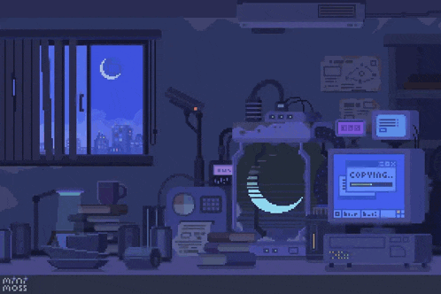

  

  ;System.out.println(%22Bem-vindo!%22);SELECT+*+FROM+pessoas+WHERE+nome+%3D+'Michely';)

# Seja bem-vindo ao meu perfil :)
 

## ✨ Sobre mim 

- 🎓 Estudando **Análise e Desenvolvimento de Sistemas** no IFSP  
- 🧠 Focada em aprender novas tecnologias sobre desenvolvimento fullstack
- 🌱 Atualmente aprendendo sobre **Java** e **React**  
- 💼 Em busca da **minha primeira oportunidade na área de TI**  
- 👩‍💻 Pronomes: **Ela/Dela**

 

## 💻 Tecnologias que utilizo

 

## 🚀 Projetos em destaque

 

## 📊 Estatísticas

  
   

  

  

    
  

   

## 🌐 Contato
 

